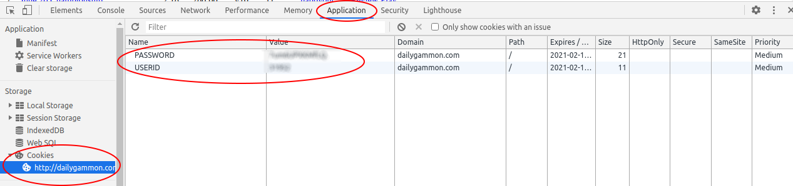

# dailygammon-championship

This script is supposed to help with the result administration. It collects match results based on match IDs. For now, it works for finished matches only. 

## usage
* Make sure that you are logged in to DailyGammon
* Your authentication token is stored in a cookie you receive from DailyGammon
* Rename .env-example to .env, and fill USERID and PASSWORD according to the cookie 
* Add the match-IDs to input.txt. Each ID shall go to a separate line (see input.txt as an example)
    * If you open a match export or review in DailyGammon, the URL will look like `http://dailygammon.com/bg/export/4311203` or `http://dailygammon.com/bg/game/4311742/1/list`. The 7 digit number in the url is the match-ID
* Once you execute match_result.py, the output should be something like that (see output.txt as an example)
    * If you make it executable, it can run on any Linux machine
    * For Windows, you have to change the first line of the script to `#! python3`

> {'match-id': 4310727,   
>  'players': ['dzsobacsi', 'hentea'],   
>  'winner': 'hentea',  
>  'score': [9, 11]}  
> 
> 
> {'match-id': 4310718, 'warning': 'the match is not finished yet'}
> 
> 
> {'match-id': 4311237,  
>  'players': ['hcc1670', 'dzsobacsi'],   
>  'winner': 'dzsobacsi',   
>  'score': [3, 11]}

To check your authentication cookie open DevTools by pressing F12 (Chrome and variants)

