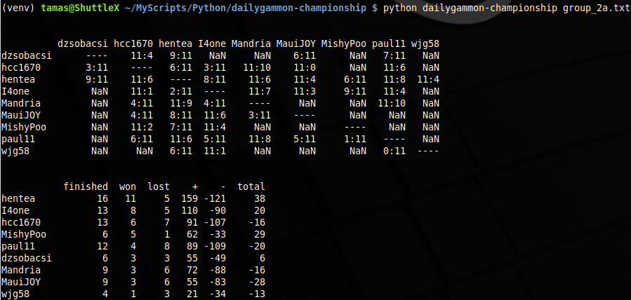

# dailygammon-championship

This script is supposed to help with the result administration. It collects match results based on match IDs and saves the results to an Excel file. Results are also output to the console, as shown in the picture below. For now, it works for finished matches only. 

## installation (Linux)

## usage
* Make sure that you are logged in to DailyGammon
* Your authentication token is stored in a cookie you receive from DailyGammon
* Rename .env-example to .env, and fill USERID and PASSWORD according to the cookie 
* Add the match-IDs to input.txt. Each ID shall go to a separate line (see input.txt as an example)
    * If you open a match export or review in DailyGammon, the URL will look like `http://dailygammon.com/bg/export/4311203` or `http://dailygammon.com/bg/game/4311742/1/list`. The 7 digit number in the url is the match-ID
* Once you execute match_result.py, the output should be something like this
    * If you make it executable (`chmod +x match_result.py`), it can run on any Linux machine
    * For Windows, you have to change the first line of the script to `#! python3`
    * Start it from the command line: `./match_result.py` (in case of Linux, I am not sure about Windows)
    * Be patient, execution can take up to 30 seconds
    * Nan indicates unfished matches
    

To check your authentication cookie open DevTools by pressing F12 (Chrome and variants)

